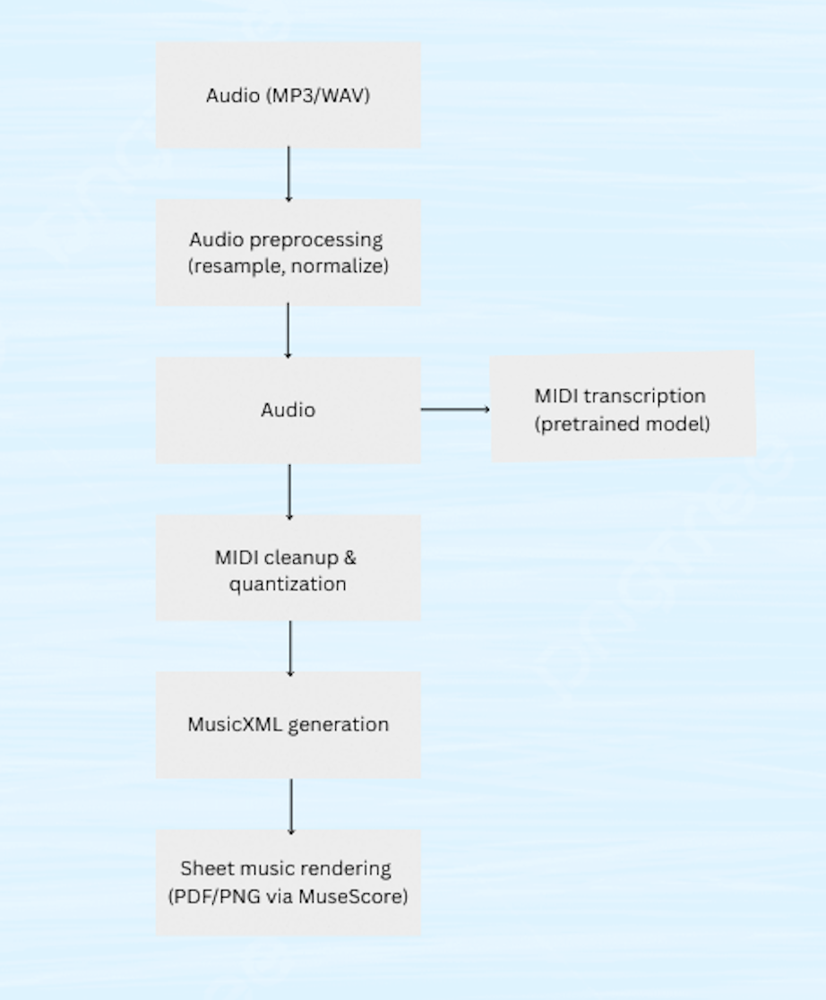

# HarmonyNet

HarmonyNet is an end-to-end AI pipeline that converts **solo piano audio (MP3/WAV/FLAC)** into **readable sheet music (PDF)**. The project is intentionally scoped to solo piano to reduce transcription ambiguity.

---

## Version 2 - SFT Encoder-Decoder (Current, POC)

> **Proof of concept.** V2 replaces the rule-based V1 backend with a fine-tuned encoder-decoder Transformer. The model is trained on MAESTRO v3 and outputs MIDI token sequences directly from audio spectrograms.

### Architecture

| Component | Details |
|-----------|---------|
| **Encoder** | Whisper (tiny/base) pre-trained audio encoder, Mel spectrogram → hidden states |
| **Decoder** | Custom 4-layer causal Transformer  cross-attends to encoder output |
| **Input** | 80-bin Mel spectrogram, 10s chunks at 16 kHz (Whisper format: [1, 80, 3000]) |
| **Output** | MIDI token sequence → NoteEvents → MusicXML → PDF |
| **Parameters** | ~37M encoder (Whisper tiny) + ~10M decoder (trainable in Phase A) |

### Token Vocabulary

The decoder outputs a flat token sequence encoding notes as discrete events:

| Token range | Meaning |
|-------------|---------|
| `0` | `<BOS>` - start of sequence |
| `1` | `<EOS>` - end of sequence |
| `2` | `<PAD>` - padding |
| `3–90` | `NOTE_ON` for MIDI pitches 21–108 (piano range) |
| `91–178` | `NOTE_OFF` for MIDI pitches 21–108 |
| `179–378` | `TIME_SHIFT` - 200 steps × 50ms = up to 10s of timing |

Total vocabulary size: **379 tokens**.

### Supervised Fine-Tuning (SFT) - Two-Phase Training

Training uses **teacher forcing** (ground-truth previous tokens fed as decoder input) across two phases:

**Phase A - Decoder only (encoder frozen)**
- Encoder weights locked; only decoder (~10M params) trained
- Learning rate: 1e-4 for 10 epochs
- Rationale: Whisper's pre-trained representations are already high quality. Training the decoder first gives it time to learn the token vocabulary before disturbing the encoder.

**Phase B - Joint fine-tuning**
- Encoder unfrozen; trained jointly with lower LR (1e-5 encoder, 1e-4 decoder)
- 5 additional epochs
- Rationale: After the decoder converges, subtle encoder adaptation to piano-specific spectral patterns improves note boundary precision.

### Training

- **Dataset**: MAESTRO v3.0.0 (Yamaha Disklavier recordings with aligned MIDI ground truth)
- **Subset used**: 50 pieces (~8 hours of audio)
- **Segments**: 10-second overlapping windows; spectrogram [1, 80, 3000], token sequence up to 512 tokens
- **Loss**: Cross-entropy on token predictions (teacher forcing)
- **Hardware**: Apple M-series (MPS backend), batch size 8

| Phase | Epochs | Train Loss | Val Loss |
|-------|--------|-----------|---------|
| A (frozen encoder) | 10 | ~2.4 | ~2.7 |
| B (joint) | 5 | ~2.3 | ~2.71 |

### Evaluation

Note-level Precision / Recall / F1 using the `mir_eval` standard:
- A predicted note is a **True Positive** if it matches a reference note on the **same pitch** with onset within **50ms**
- Each reference note can only be matched once (greedy matching by onset proximity)

Run evaluation:
```bash
python -m src.v2.evaluate --checkpoint models/v2/best_model.pt --max-segments 20 --split validation
```

> **POC caveat**: The model was trained on a 50-piece subset. F1 scores reflect early-stage training and will improve with more data and training compute. The architecture is sound, training requires more compute power to extend capability.

### V2 CLI Usage

**Transcribe using the V2 model:**
```bash
python -m src.cli transcribe data/inputs/fur_elise.mp3 --model v2 -o output_v2.pdf
```

**With a specific checkpoint:**
```bash
python -m src.cli transcribe data/inputs/fur_elise.mp3 --model v2 --checkpoint models/v2/best_model.pt
```

**MusicXML only (no PDF):**
```bash
python -m src.cli transcribe data/inputs/fur_elise.mp3 --model v2 --no-pdf
```

### V2 File Map

```
src/v2/
├── __init__.py          # Package exports
├── model.py             # PianoTranscriptionModel (Whisper encoder + causal decoder)
├── tokenizer.py         # Token vocabulary, encode_notes(), decode_tokens()
├── spectrogram.py       # WhisperSpectrogramExtractor → [1, 80, 3000]
├── dataset.py           # MAESTRODataset, segment pipeline, teacher-forcing batches
├── train.py             # Two-phase SFT Trainer (Phase A + Phase B)
├── transcribe.py        # Inference bridge: audio → chunks → NoteEvents → TranscriptionResult
└── evaluate.py          # Note-level P/R/F1 evaluation against MAESTRO MIDI ground truth
models/v2/
└── best_model.pt        # Best checkpoint (val_loss=2.71, 50 pieces, 15 epochs)
```

### Known V2 Limitations (POC)

- **Small training set**: 50 pieces is far below the full MAESTRO dataset (~1,200 pieces). F1 will improve with scale.
- **O(n²) inference**: No KV cache - `nn.TransformerDecoder` re-runs full self-attention over all past tokens each step at O(n^2). Inference is slow for long sequences. A KV cache implementation is the primary production improvement.
- **Single clef output**: No grand staff splitting (treble only).
- **Token budget**: `max_gen_tokens=128` per 10s chunk trades recall for speed (dense passages may be truncated).

---

## Sample Outputs

Pre-generated PDFs are in `data/outputs/`. These were produced by V1 with correct tempo and time signature settings.

| Piece | Tempo | Time Sig | Notes detected | Output |
|-------|-------|----------|---------------|--------|
| Für Elise | 72 BPM | 3/8 | 1747 | [fur_elise.pdf](assets/samples/fur_elise.pdf) |
| Gymnopedie No. 1 | 54 BPM | 3/4 | 841 | [gymnopedie.pdf](assets/samples/gymnopedie.pdf) |
| C Major Scale | 120 BPM | 4/4 | 8 | [c_major_scale.pdf](assets/samples/c_major_scale.pdf) |
| Für Elise (V2 model) | — | — | 246 | [fur_elise_v2.pdf](assets/samples/fur_elise_v2.pdf) |

To regenerate them yourself:
```bash
# Für Elise
python -m src.cli transcribe data/inputs/fur_elise.mp3 -o data/outputs/fur_elise.pdf --tempo 72 --time-sig 3/8

# Gymnopedie No. 1
python -m src.cli transcribe data/inputs/Gymnopedie.mp3 -o data/outputs/gymnopedie.pdf --tempo 54 --time-sig 3/4

# Für Elise with V2 model
python -m src.cli transcribe data/inputs/fur_elise.mp3 --model v2 -o data/outputs/fur_elise_v2.pdf
```

---

## Setup and Requirements

**Python 3.12+** required.

```bash
git clone https://github.com/your-username/HarmonyNet.git
cd HarmonyNet
python -m venv venv
source venv/bin/activate        # Windows: venv\Scripts\activate
pip install -r requirements.txt
```

### MuseScore (optional, for PDF rendering)

Install MuseScore 4 from: https://musescore.org/en/download

**Default locations:** <br/>
macOS:  `/Applications/MuseScore 4.app/Contents/MacOS/mscore` <br/>
Linux:  `/usr/bin/mscore` or `/usr/local/bin/mscore4` <br/>
Windows: `C:\Program Files\MuseScore 4\bin\MuseScore4.exe` <br/>

If MuseScore is not installed, the pipeline still produces MusicXML output that can be opened in any notation software.

**Check all dependencies:**
```bash
python -m src.cli check
```

### V2 Model Checkpoint

V2 requires a trained checkpoint at `models/v2/best_model.pt`. Either:
- **Use the included checkpoint** (if distributed with this repo), or
- **Train from scratch** — requires MAESTRO v3 audio data:
```bash
python -m src.v2.train
```
Training on 50 pieces takes ~2–3 hours on an Apple M-series chip.

---

## Version 1 - Baseline System (Complete)

V1 builds a working end-to-end pipeline using **basic-pitch** (Spotify's ICASSP 2022 model) as the transcription backend. No custom ML training required.

### V1 Pipeline



**Audio → basic-pitch CNN → NoteEvents → Quantizer → MusicXML → PDF**

### What V1 does well
- Accurate pitch detection across the full 88-key piano range (MIDI 21–108)
- Correct onset timing and note durations
- Works on real recordings (tested with Fur Elise, Gymnopedie No. 1)
- Configurable tempo, time signature, and detection thresholds

### Known V1 Limitations
- Slightly poor rest detection
- Accuracy improves significantly when tempo and time signature are specified explicitly
- Pedal/sustain not modeled — held bass notes may show as incorrect durations

### V1 Tested On
- C major scale (synthetic, 8 notes) — perfect transcription
- Fur Elise (3 min recording, 1747 notes) — correct opening melody, full piece captured
- Gymnopedie No. 1 (3 min recording, 841 notes) — sparse texture transcribed cleanly

### V1 CLI Usage

**Generate sheet music PDF:**
```bash
python -m src.cli transcribe input.mp3 -o output.pdf
```

**With custom tempo and time signature:**
```bash
python -m src.cli transcribe data/inputs/Gymnopedie.mp3 -o data/outputs/gymnopedie.pdf --tempo 54 --time-sig 3/4
```

**MusicXML only:**
```bash
python -m src.cli transcribe input.mp3 --no-pdf
```

### V1 CLI Options

| Option | Default | Description |
|--------|---------|-------------|
| `--tempo` | 120 | Tempo in BPM |
| `--time-sig` | 4/4 | Time signature |
| `--onset-threshold` | 0.5 | Onset detection sensitivity (0–1) |
| `--frame-threshold` | 0.3 | Note frame sensitivity (0–1) |
| `--title` | filename | Score title |
| `--no-pdf` | false | Output MusicXML only |
| `--keep-musicxml` | false | Keep MusicXML alongside PDF |

### V1 Technical Notes

- **ONNX Runtime** is used instead of TensorFlow for Python 3.12 compatibility. See `docs/inference_guide.md`.
- **basic-pitch** (ICASSP 2022 model) provides the CNN that produces onset, note, and contour predictions from Harmonic CQT spectrograms.
- **music21** handles MusicXML encoding. **MuseScore** handles PDF rendering.
- A scipy compatibility shim patches `scipy.signal.gaussian` for scipy 1.14+ (see `src/inference.py`).
